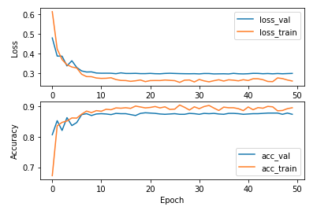

# Task_2
A neural network has been implemented that is able to determine the gender of a person in the image from the input image of the face.

### Script launch
To use a neural network, you need to pass a folder with images through the arguments.

The model does not need to be trained, since its parameters have already been saved in model_trained.pt.
```
$ python3 process.py folder/images
```
The script saves the process_results.json file with information about the processing results.

### Data
As a training and valid dataset I used https://drive.google.com/file/d/1-HUNDjcmSqdtMCvEkVlI0q43qlkcXBdK/view.
Before training, the data must be divided into two parts: training and validation.

### Train model
Since I don't have a GPU, I used 2000 training images and 1000 validation images, which probably affected the accuracy.

The "ResNet18" model was taken as a basis. Cross-entropy was chosen as the loss function, since it is well suited for binary classification. Adam was chosen as the optimizer. To improve the quality of the model, I used augmentation.

### Eval
Accuracy 87.4 %

Perhaps this low accuracy is due to the small amount of training data. If you have a GPU, you can try to train the model on more data.

<p align="center"></p>

### Author
Dembovsky M.V. — master, Department of Biomedical Engineering systems, Bauman Moscow State Technical University, Moscow, Russian Federation.
